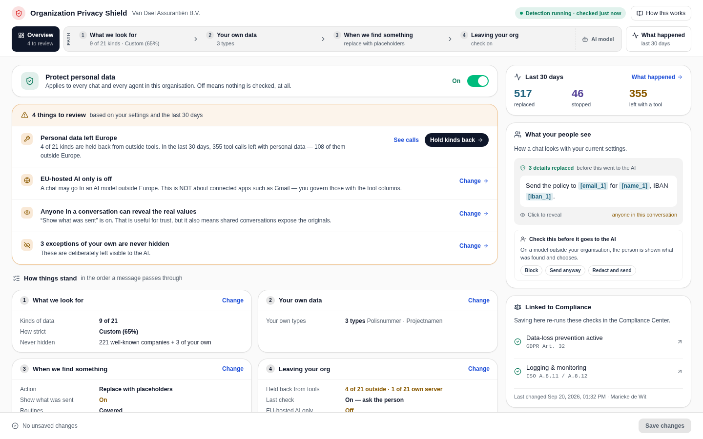
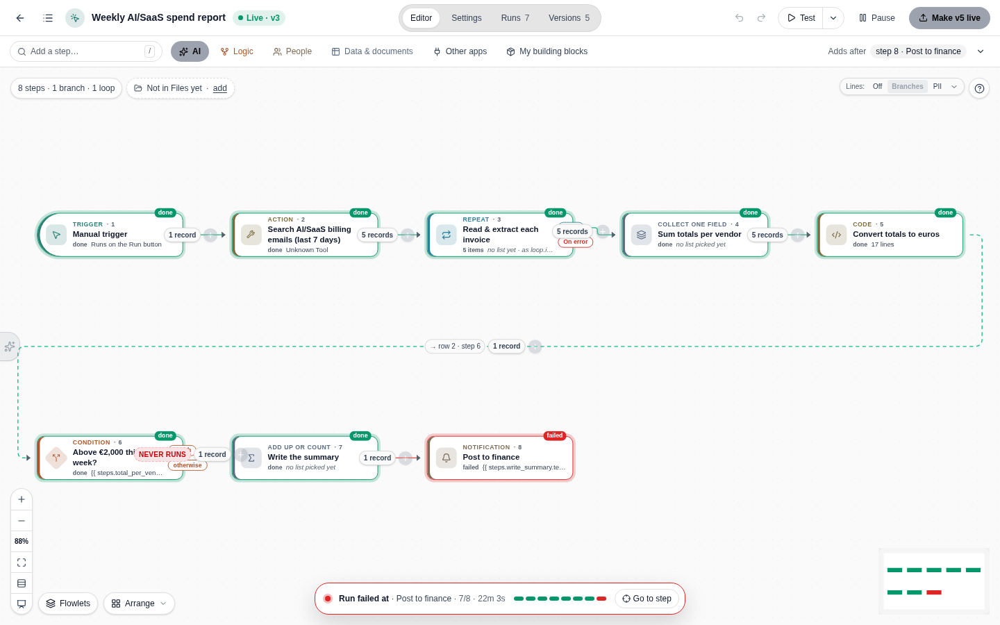
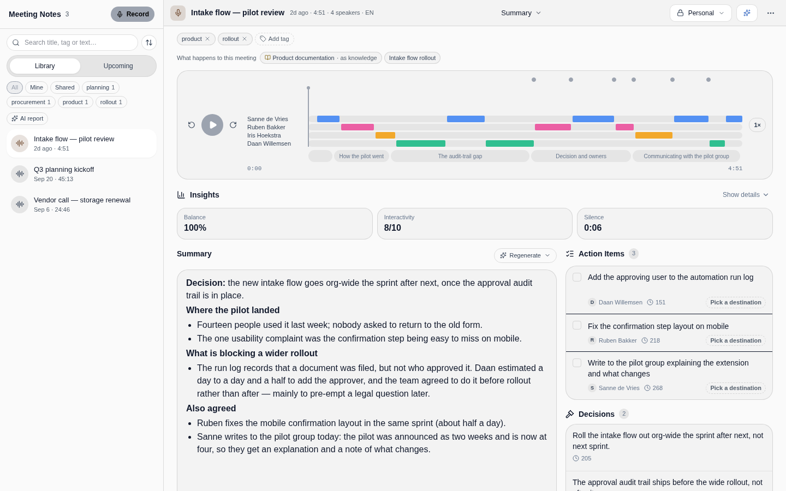
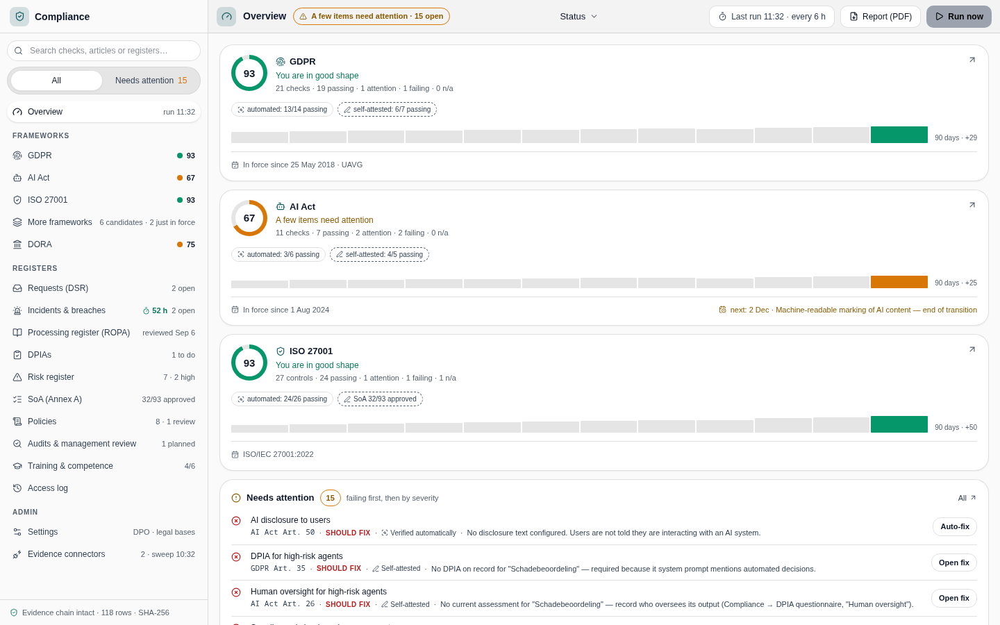
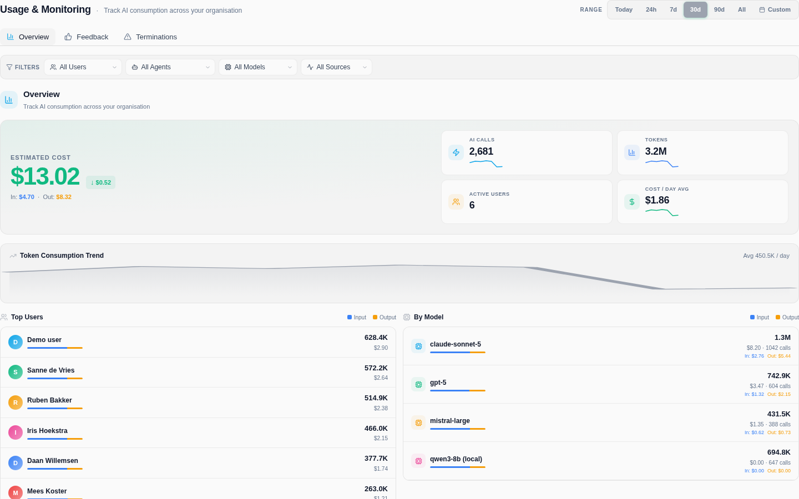
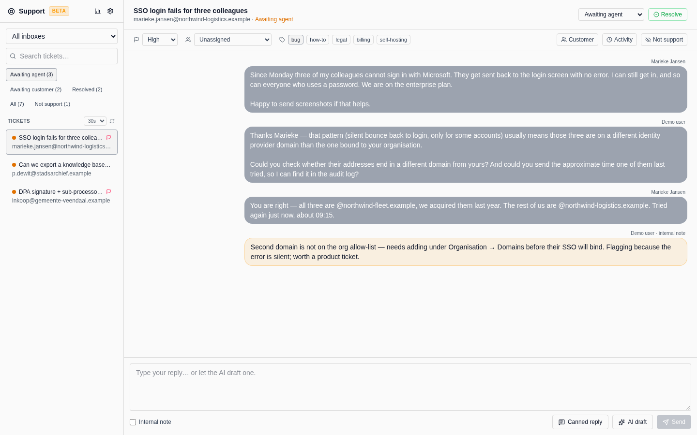

<p align="center">
  
</p>

<h1 align="center">Bee Flow</h1>

<p align="center">
  <strong>The private AI workspace for your organisation.</strong><br>
  Chat, agents, automations and meeting notes on your own server,<br>
  with personal data protected before it ever reaches an AI model.
</p>

<p align="center">
  <a href="#quick-start"><strong>Quick start</strong></a> ·
  <a href="#what-you-can-do">Features</a> ·
  <a href="https://docs.beeflow.ai">Documentation</a> ·
  <a href="#security-and-privacy">Security</a> ·
  <a href="https://beeflow.nl">Website</a>
</p>

<p align="center">
  
  
  
  
</p>

<p align="center">
  
</p>

## Why Bee Flow

Bee Flow is an alternative to ChatGPT Teams and Microsoft Copilot for organisations that want to decide
for themselves where their data goes.

- **It runs where you put it.** One command on your own server. Use cloud models (Anthropic, OpenAI,
  Google, Azure, Mistral), EU-hosted ones (Scaleway, EU GPT), or models on your own hardware (Ollama,
  vLLM, llama.cpp, LM Studio and more).
- **Privacy is built in.** Privacy Shield finds personal data and swaps it for placeholders before a
  message reaches a model, and decides per tool what may leave your organisation.
- **Compliance you can show.** A Compliance Center with continuous checks and the registers auditors ask
  for, covering GDPR, the EU AI Act, ISO 27001 and DORA.
- **No code needed.** Build assistants, automations and small apps visually, on top of your own documents,
  mail and calendars.
- **It fits your stack.** A native Nextcloud integration, a desktop app for Linux, macOS and Windows, and a
  native Android app.

## What you can do

### Assistants that know your organisation

- Build an assistant for a team or a task: instructions, knowledge, skills, tools and model, on one screen.
- Knowledge bases from files (PDF, Word, Excel, CSV, Markdown), web pages, tables and meeting notes, with
  OCR for scanned documents.
- Hybrid search (pgvector plus full text) reranked by a self-hosted cross-encoder. Answers cite their
  sources.
- Notebooks: a document you write together with the AI, next to the sources it draws from.
- Connect Google Workspace, Microsoft 365, Nextcloud, GitHub, web search and any server that speaks the
  Model Context Protocol (MCP).

### Automations you can watch



Routines chain triggers, AI steps, logic, people and your apps into one flow, and show every run step by
step. Steps that act on your behalf can wait for a person to approve them. Start a routine on a schedule,
from an event, a form or a chat.

### Meeting notes with the decisions in them



Record or upload a meeting and get a transcript with speakers, a summary, the decisions and the action
items, each linked to the moment it was said. Transcription runs on your own server (WhisperX) or through
a cloud API.

### Compliance and oversight

<table>
  <tr>
    <td width="50%"></td>
    <td width="50%"></td>
  </tr>
  <tr>
    <td><strong>Compliance Center.</strong> Automated and self-attested checks for GDPR, the AI Act, ISO 27001
    and DORA, plus registers for data subject requests, incidents, processing activities, DPIAs, risks and
    policies. Exports a PDF report.</td>
    <td><strong>Usage and costs.</strong> AI usage and spend per user, assistant and model, with local models
    counted at zero cost.</td>
  </tr>
</table>

### And more

- **Privacy Shield** (shown at the top): detection of names, addresses, bank and ID numbers, credentials
  and more with a model you host yourself, placeholders instead of real values, and a check with the
  person before data leaves for an outside tool.
- **Support inbox** (beta): a shared inbox where the AI drafts replies and flags what needs a person.
- **Studio**: forms, data tables, documents (quotes, invoices, letters as PDF or Word), web pages and small
  apps, all connected to your automations.

<details>
<summary>Screenshot of the support inbox</summary>
<br>

</details>

## Quick start

Run your own Bee Flow server with one command. It pulls the public images from `ghcr.io/bee-flow` (no
login needed), generates secrets, starts the core stack and prints your URL and admin password.

```bash
git clone https://github.com/Bee-Flow/Bee-Flow.git
cd Bee-Flow
./selfhost.sh
```

**Free to start.** The Community tier needs no licence key: chat, knowledge bases, multiple users and the
Nextcloud connector. Premium features such as automations, meeting notes and guardrails unlock with a
licence under **Admin → Licence**. See [beeflow.nl](https://beeflow.nl).

**Using Nextcloud?** Point the Bee Flow connector at your server from **Nextcloud → Settings →
Administration → AI → Bee Flow**, choose *Self-hosted server* and enter your URL.

The full guide is in the [self-hosting documentation](./docs/docs/self-hosting/index.md).

<details>
<summary>Notes for Docker hosts: the server runs as a non-root user</summary>

The server image runs as `node` (uid 1000). Two consequences:

- It still drives Docker over the mounted socket (installing the PII guard, the browser runner and the
  security scan), so it must be in the socket's group. The published image is built with
  `DOCKER_GID=999`, the usual gid on Debian and Ubuntu. If `stat -c %g /var/run/docker.sock` says
  otherwise, add `group_add: ["<that gid>"]` to the `server` service, or rebuild with
  `--build-arg DOCKER_GID=<that gid>`.
- **Upgrading an install that ran the old root image:** its `beeflow-data` volume is root-owned, and so is
  whatever the old image wrote into `components/`. Hand both to the new user once before starting the new
  image: `docker compose run --rm --user root server chown -R node:node /app/data /components`. The same
  is needed whenever `components/` is not owned by uid 1000: a first `docker compose up` without
  `./selfhost.sh`, `./selfhost.sh` run with `sudo` or by another user, or rootless Docker. Until then the
  Component Designer cannot save.
</details>

<details>
<summary>Other ways to run Bee Flow: which compose file to use</summary>

| File | Purpose |
|---|---|
| `docker-compose.from-registry.yml` | Self-host from the prebuilt public images. This is what `./selfhost.sh` uses. Profile-based (`core`, `search`, `guard`, `whisperx`, `pii`, …). |
| `docker-compose.dockerhub.yml` | Minimal self-contained stack from Docker Hub images: this file plus a `.env` is the whole install. |
| `docker-compose.portainer.yml` | Stack to paste into Portainer, pulling the public images (see `.env.portainer.example`). |
| `docker-compose.install.yml` | Profile-based stack generated and used by the Install Wizard. |
| `docker-compose.yml` | Builds server, agent-hub, guard-service and reranker from this checkout. |
| `docker-compose.local.yml` | Override on top of `docker-compose.yml` for local runs (Postgres on host port 5433, fixed dev session secret, auto-restart). |
| `docker-compose.dev.yml` | Development with the source mounted into the containers for hot reload. |
| `docker-compose.services.yml` | Backing services only (database, storage, Redis), with frontend and backend running on the host. |
| `docker-compose.security.override.yml` | Opt-in layer that enables the security-scan worker on the registry stack. |

Each file starts with a header comment that explains its use.
</details>

## Develop locally

For day-to-day work you only need the two core services, the React frontend and the Node.js backend, plus
a PostgreSQL database with `pgvector`.

**Prerequisites:** Node.js 22 (>= 22.12, see `.nvmrc`) with npm 10+, Docker for the database container,
Git, and Python 3.10+ on Linux and macOS for the install script.

```bash
git clone https://github.com/Bee-Flow/Bee-Flow.git
cd Bee-Flow
python3 install-local.py          # Windows: powershell -ExecutionPolicy Bypass -File .\install-local.ps1
npm run dev:all                   # backend on :3101, frontend on :5276
```

The installer installs the npm dependencies, starts a `pgvector` container named `beeflow-postgres` on
host port `55432`, writes a `.env` with a fresh `SESSION_SECRET` and runs the database migrations.

<details>
<summary>More on the local setup</summary>

- Run the two services in separate terminals with `npm run dev:server` and `npm run dev:frontend`.
- Start and stop the database with `docker start beeflow-postgres` and `docker stop beeflow-postgres`.
- Without Docker, install PostgreSQL 15+ with `pgvector` yourself and create a database `beeflow_tasks`
  owned by user `beeflow` (password `beeflow`). The script notices that Docker is missing and skips that
  step.
- The ports (`55432`, `3101`, `5276`) are deliberately unusual so they don't clash with other servers you
  may run. Change them in `.env` if you like.
- Optional services (object storage, Redis, transcription, PII detection, search and reranking, GPU
  inference) are not needed for the core experience. Start one with
  `docker compose -f docker-compose.dev.yml up -d <service>`.
</details>

See [CONTRIBUTING.md](./CONTRIBUTING.md) for the test commands per module and how pull requests are checked.

## Models and providers

| Where the model runs | Providers |
|---|---|
| Cloud | Anthropic Claude, OpenAI, Google Gemini and Vertex AI, Azure OpenAI, Mistral |
| EU-hosted | Mistral (EU endpoint), Scaleway Generative APIs, EU GPT |
| Your own hardware | Ollama, vLLM, llama.cpp, LM Studio, SGLang and other OpenAI-compatible runtimes |

Embeddings, reranking, PII detection and transcription can all run on your own server, on CPU or GPU.

## Clients

| Client | Runs on | What it is |
|---|---|---|
| **Web** (`agent-hub/`) | any browser | The workspace, served by your own server. |
| **Desktop** (`desktop/`) | Linux, macOS, Windows | A native shell around the same web app: tray icon, a global quick-ask shortcut, notifications, `beeflow://` links, and a bridge to the Nextcloud desktop app so attached files are referenced instead of copied. See [desktop/README.md](desktop/README.md). |
| **Android** (`mobile/`) | Android phones | A native app with its own phone-shaped design, not a web wrapper. See [mobile/README.md](mobile/README.md). |

## Architecture

- **Frontend:** a React single-page app (Vite, Tailwind CSS).
- **Backend:** Node.js and Express for the API, streaming chat and automations.
- **Storage:** PostgreSQL with `pgvector`, S3-compatible object storage (RustFS) and Redis.
- **Sidecars:** small Python services for PII detection, reranking, search and document extraction,
  transcription and topic classification. Each is optional.

The repository layout is described in [REPO-STRUCTURE.md](./REPO-STRUCTURE.md).

## Security and privacy

- **Personal data stays inside.** Privacy Shield replaces personal data with placeholders before a
  prompt reaches a model and controls per tool what may leave. Detection runs on your own server.
- **Encryption at rest, per organisation** (Enterprise licence): choose *managed* keys, which an
  administrator can recover, or *zero-knowledge*, where only the user can decrypt their content. It is off
  by default. Built on AES-256-GCM, Argon2id and OPAQUE.
- **Sign-in:** passwords, Google, Microsoft and Nextcloud sign-in, SAML (Enterprise), and two-factor
  authentication with an authenticator app or a security key.
- **Audit trail:** sign-in and access logs, and a hash-chained evidence log in the Compliance Center.

Found a vulnerability? Please report it privately, as described in [SECURITY.md](./SECURITY.md).

## Licence

Bee Flow is **fair-code**. You may use it, change it and run it for your own organisation. Offering Bee
Flow itself as a paid hosted service to others needs a separate agreement. The server, frontend and
clients use the Sustainable Use License; the Nextcloud connector uses AGPL-3.0-or-later. See
[LICENSE.md](./LICENSE.md) for the overview per component.
